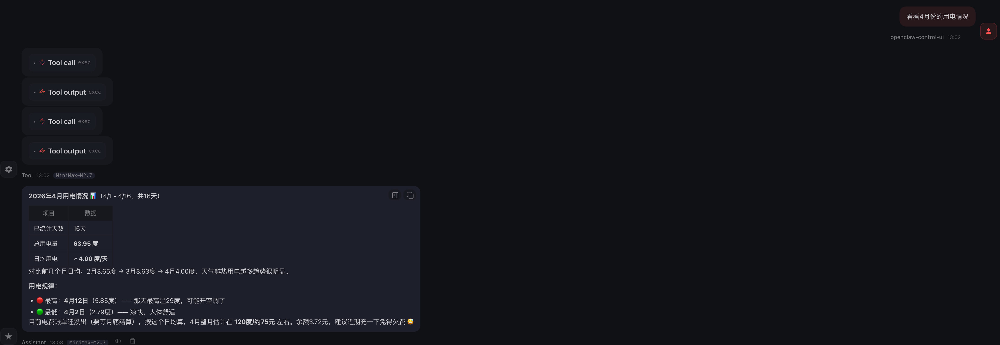
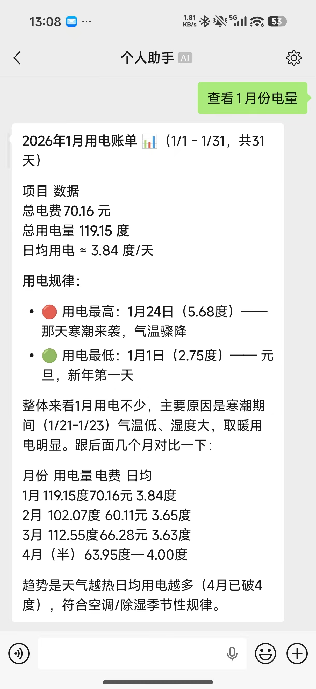

# CSG CLI Skill

这是一个用于查询**南方电网**（China Southern Power Grid）电费、电量、账户余额等信息的命令行工具 Skill。

## 功能特性

- 查询账户余额和欠费
- 查询昨日用电量
- 查询月度用电日历（含温度数据）
- 查询月度电费账单
- 查询年度用电统计
- 多账户支持

## 使用前提

- 已安装 `uv`（推荐）或 `python`
- 已安装依赖：`typer` ，`rich` ，`pycryptodome`
```bash
uv pip install pycryptodome typer rich
```

## openclaw调用



## 致谢

本 Skill 基于 [CubicPill/china_southern_power_grid_stat](https://github.com/CubicPill/china_southern_power_grid_stat) 项目改造而来，感谢原作者的贡献。
